# 헥토 슬라이드 스킬

Claude로 헥토 브랜드 규격 16:9 PPTX 생성

- 좌표·색·폰트를 헬퍼가 고정. 사람이 좌표를 쓰지 않음
- 생성 결과를 규칙 11개로 자동 판정. 통과 못 하면 배포 불가
- 레이아웃 16종, 컴포넌트 전 종류 지원
- 상시 비용 약 195토큰. 스킬 호출 시 2.4k 추가

## 설치

### Claude Code

```
/plugin marketplace add hectoai/hecto-ppt
/plugin install hecto-ppt@hectoai
```

- 설치 후 `/reload-plugins` 안내가 나오면 실행
- 갱신: `/plugin marketplace update`

### Claude Desktop (Cowork)

- **Customize > Plugins > Personal > "+" > Add marketplace**
- 주소 입력: `https://github.com/hectoai/hecto-ppt`
- 목록에서 `hecto-ppt` 선택 후 설치

### Claude Desktop (zip)

Cowork 미사용 또는 위 경로 실패 시

1. **Settings > Capabilities**에서 코드 실행 활성화 (꺼져 있으면 스킬 메뉴 미표시)
2. **Customize > Skills > "+" > Upload a skill**
3. `hecto-ppt.zip` 업로드

## 사용

- 호출: "헥토 스타일로 PPT 만들어줘" 등 자연어. 스킬이 자동 인식
- 산출물: 16:9 PPTX (13.333" x 7.500")
- 좌표 스펙은 필요 시에만 로드. 대화 시작부터 상주하지 않음

Pretendard가 시스템에 설치돼 있으면 렌더가 정확해진다. 없어도 생성은 정상이며 자간과 굵기만 달라진다. OTF는 `fonts/`에 포함

## 구성

| 경로 | 역할 |
|---|---|
| `SKILL.md` | 레이아웃 선택 규칙, 절대 규칙 |
| `references/` | 토큰·컴포넌트·레이아웃·관례 상세 |
| `lib/hecto.js` | 좌표 고정 헬퍼. 호출부에서 좌표 지정 불가 |
| `scripts/verify_pptx.py` | 규칙 11개 판정기 |
| `assets/` | 워드마크 PNG 3종 (배경색 x 컨테이너 조합별) |
| `fonts/` | Pretendard Regular · Bold |

## 레이아웃

실제 출력. 회귀 테스트 기준 자료에서 발췌

| 커버 | 목차 |
|---|---|
| 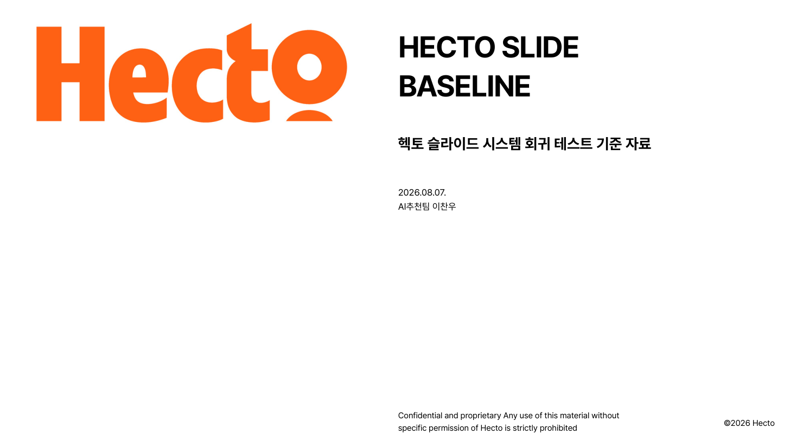 | 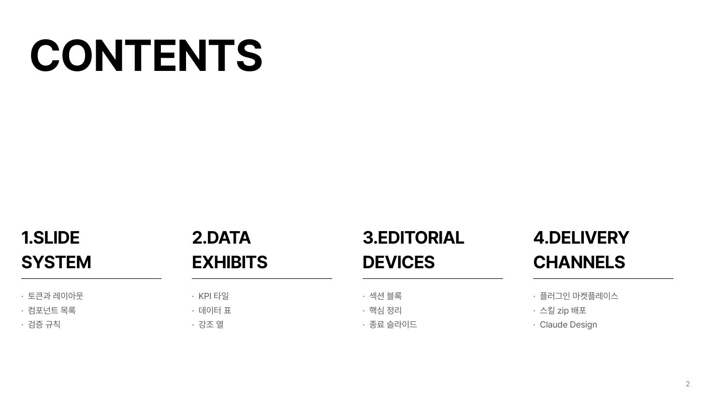 |

| 핵심 요약 (결론 + 근거 3열) | 섹션 디바이더 |
|---|---|
| 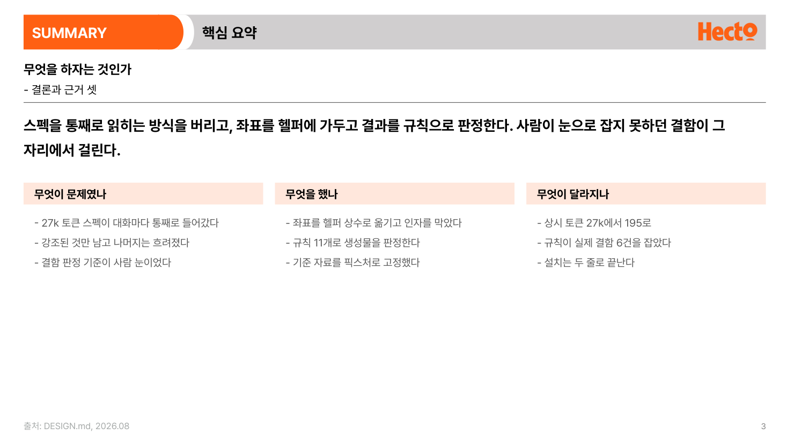 | 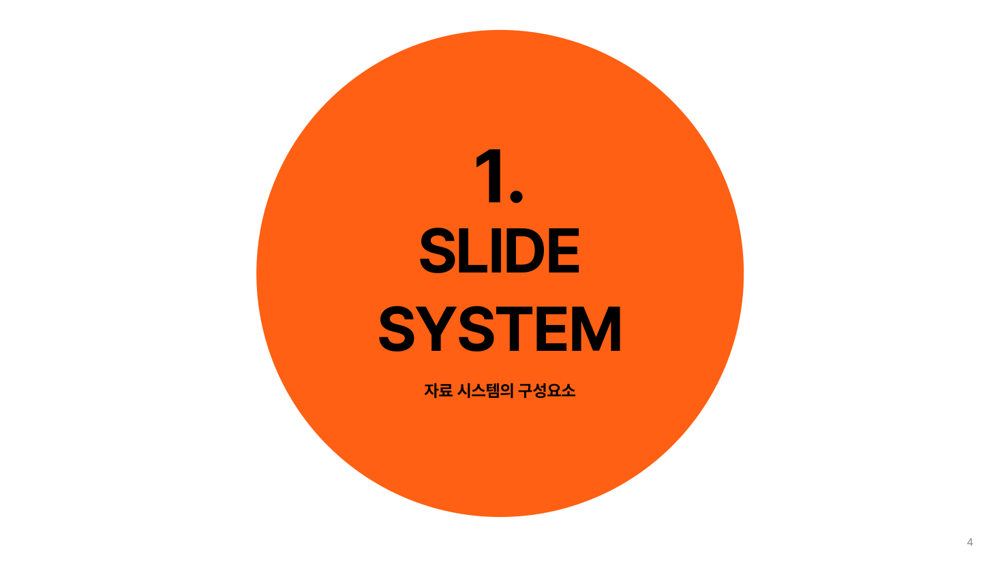 |

| 콘텐츠 표준 (`01.` `02.`) | 2x2 그리드 |
|---|---|
| 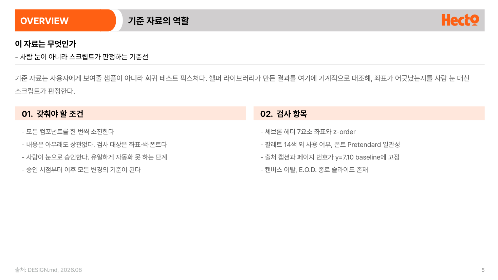 | 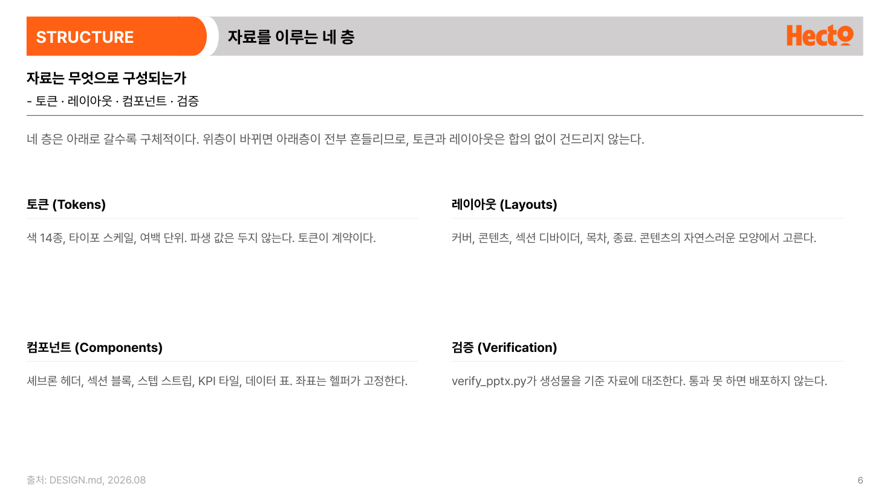 |

| 스텝 프로세스 | 스텝 심화 (한 단계 강조) |
|---|---|
| 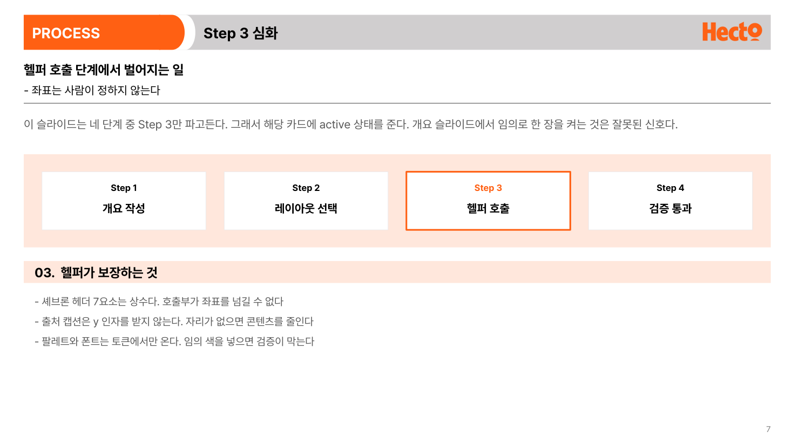 |  |

| 3단 컬럼 | 비교 (`A.` `B.`) |
|---|---|
| 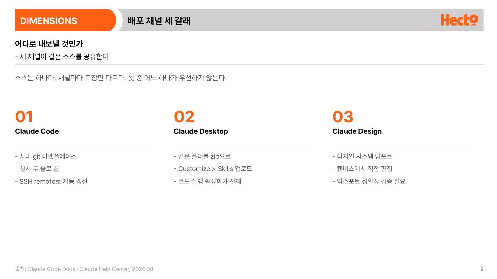 | 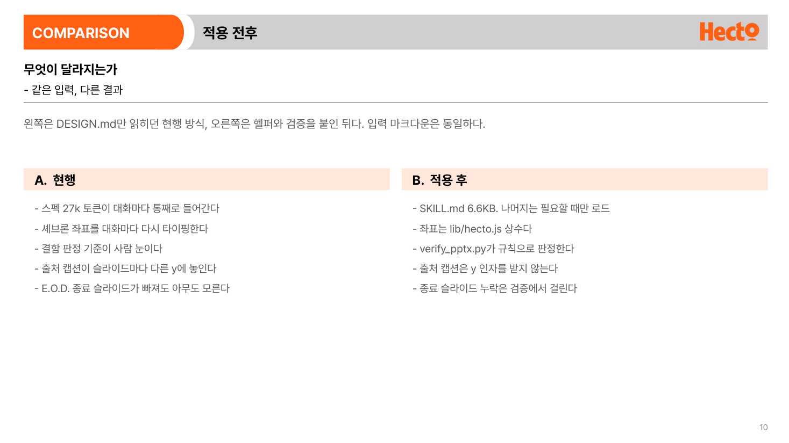 |

| 히어로 스탯 | KPI 3연 + 데이터 표 |
|---|---|
| 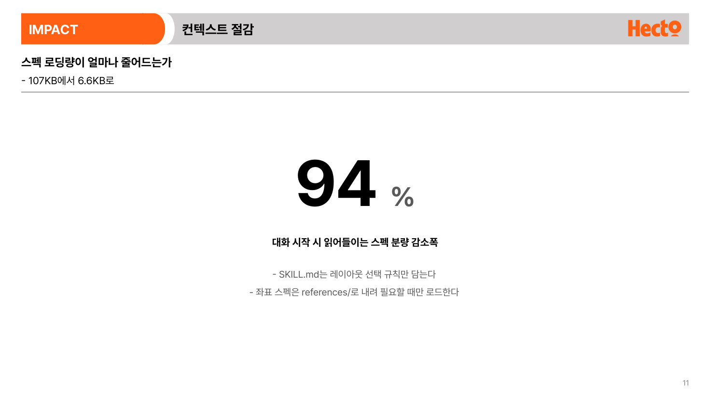 |  |

| 자유 배치 (긴 글) | 핵심 정리 |
|---|---|
| 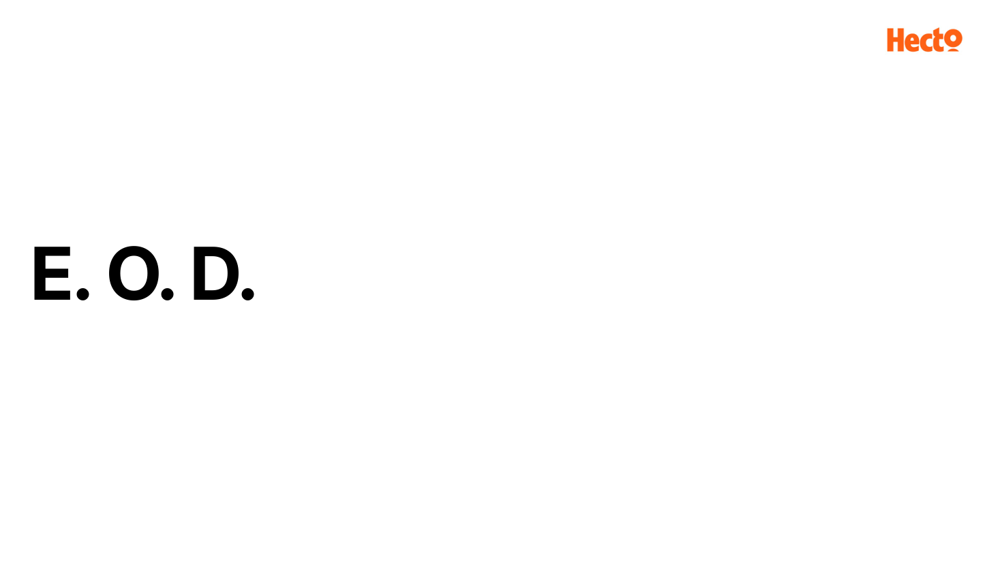 | 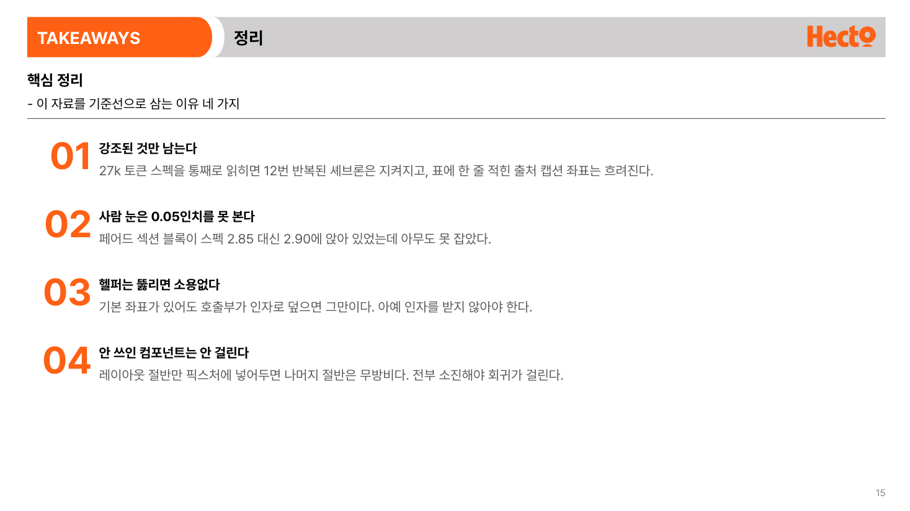 |

| 부록 간지 | 전면 데이터 표 |
|---|---|
| 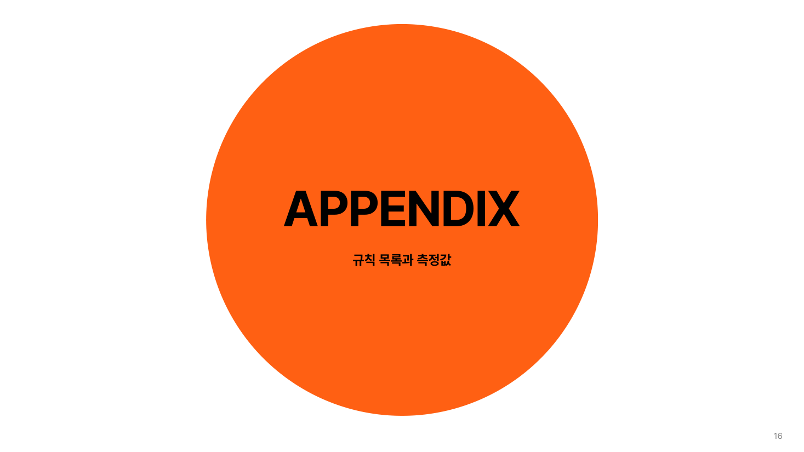 | 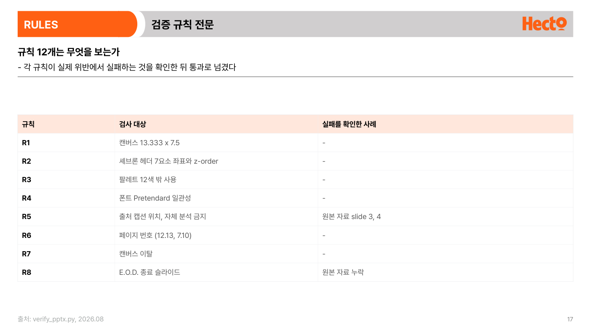 |

| 종료 (E.O.D.) | |
|---|---|
|  | |

## 버전

0.6.1
